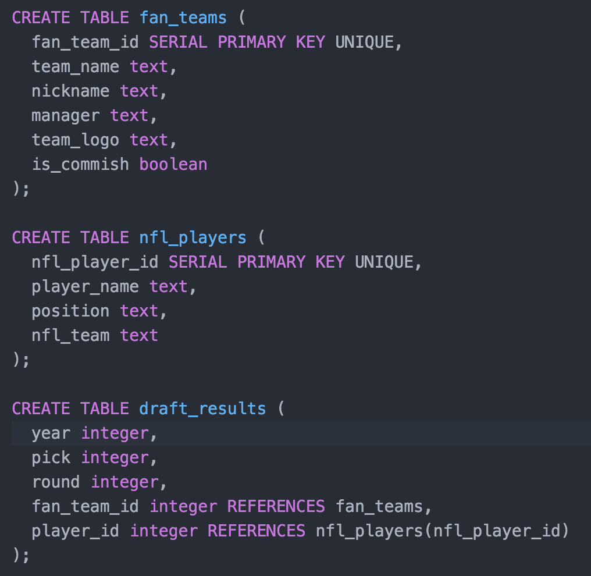
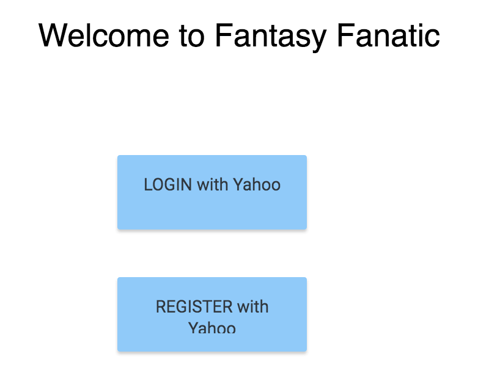
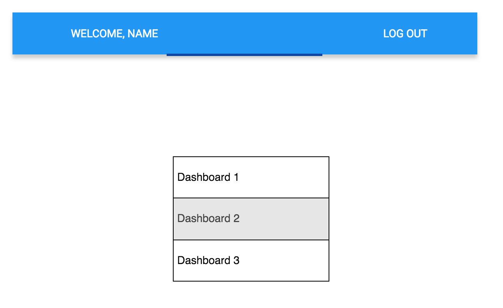
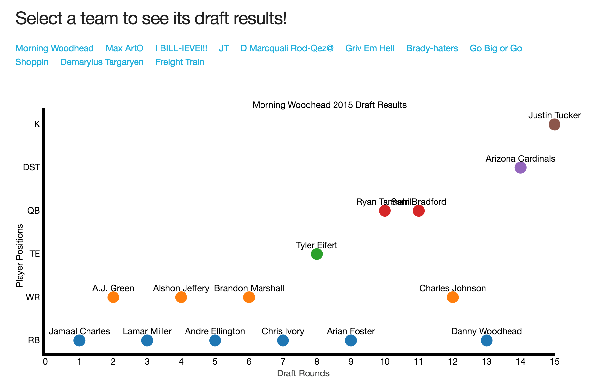

# Fantasy Fanatic

My final project for General Assembly WDI. This site provides dashboard views of how my fantasy football league drafted in previous years. This information will give me more insight into my competitors to help me dominate my upcoming draft and return to championship in years to come.

This site is a prototype for one of the views that I can generate from fantasy league API (Yahoo) in the future.

---
## Technologies
- Node.js
- Oauth2 (phase 2)
- Yahoo Fantasy API (phase 2)
- d3.js
- PostgresSQL

---
## ERD

---
## Wireframes
### Login/Home (phase 2)

### Main Page

### Single Team Draft View

### Overall Draft View

---
## Routes
| Action | Route                 | Description                                                   |
|--------|-----------------------|---------------------------------------------------------------|
| GET    | /                     | Landing page, shows  welcome message, mission statement       |
| GET    | /apis/players         | Generates list of players and attributes associated with them |
| GET    | /apis/teams           | Generates list of teams in the league                         |
| GET    | /apis/draftresults    | Generates view of the draft results for all teams             |
| GET    | /apis/draftresults/id | Generates view of the draft results for a single team         |

---
## User Stories

### User Log In and Registration
1. As a user, I can log in with my Yahoo account (future enhancement)

1. As a user, I am redirected through Oauth with Yahoo to connect to the site. (future enhancement)

1. As a new user, I can register with my Yahoo account with the application (future enhancement)

1. As a user, after I log in, I am redirected to the main page of the site (future enhancement)

1. As a user, I can log out (future enhancement)

### Dashboards

1. As a user, I can see a scatterplot chart for each team that shows how they drafted in previous years

1. As a user, I can see a scatterplot chart of the positions drafted in prior years by round within the league

---
